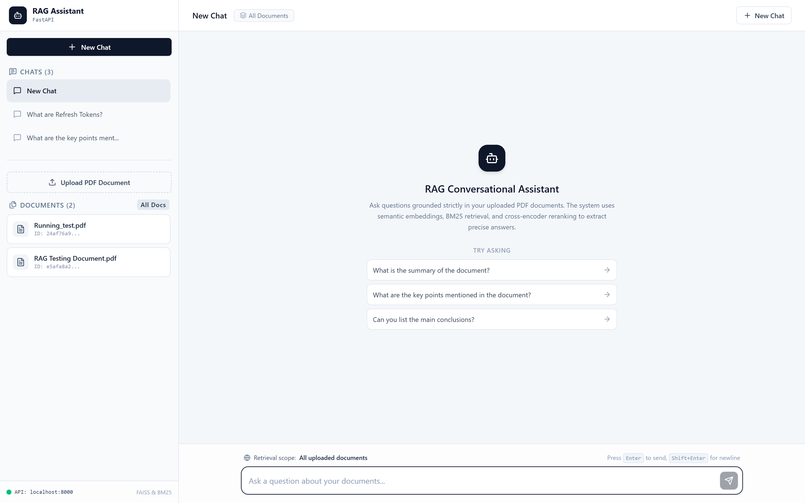
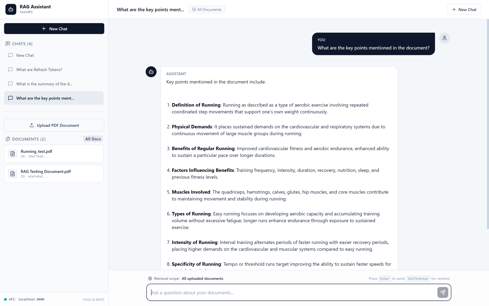
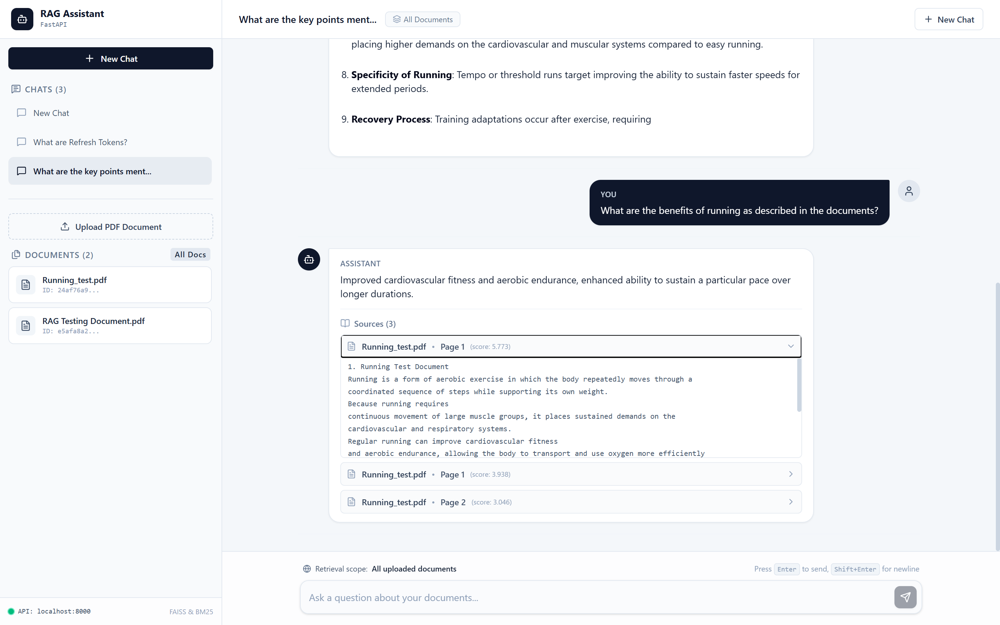

# RAG Conversational Agent

A context-aware Retrieval-Augmented Generation (RAG) conversational agent that allows users to upload PDF documents and ask questions about their content.

The system combines semantic search, keyword-based retrieval, hybrid retrieval, reranking, conversational query rewriting, persistent conversation history, and Redis caching to provide grounded answers from uploaded documents.

---

## 🚀 Features

- 📄 PDF document upload and parsing
- ✂️ Section-aware + fixed-size text chunking
- 🧠 Semantic embeddings using Sentence Transformers
- 🔎 Dense retrieval using FAISS
- 🔤 Keyword retrieval using BM25
- 🔀 Hybrid retrieval using Reciprocal Rank Fusion (RRF)
- 🎯 Cross-encoder reranking
- 🧾 Metadata-based document filtering
- 💬 Conversational context and chat history
- 🔄 Conversational query rewriting
- 🤖 Local LLM inference using Qwen
- ⚡ Redis-based answer caching
- 💾 Persistent conversations using SQLite + SQLAlchemy
- 🧪 Retrieval evaluation and automated tests
- 📊 Retrieval metrics such as Recall@1 and Recall@3
- 📝 Backend logging
- 🌐 React frontend
- 🎨 Tailwind CSS + shadcn/ui
- 🐳 Docker support

---

## 🏗️ Architecture

```text
                    ┌─────────────────────┐
                    │      React UI       │
                    │ Tailwind + shadcn   │
                    └──────────┬──────────┘
                               │
                               ▼
                    ┌─────────────────────┐
                    │      FastAPI        │
                    │       Backend       │
                    └──────────┬──────────┘
                               │
              ┌────────────────┼────────────────┐
              │                │                │
              ▼                ▼                ▼
       ┌────────────┐   ┌─────────────┐   ┌────────────┐
       │ PDF Parser │   │Conversation │   │   Redis    │
       │  PyMuPDF   │   │   Storage   │   │   Cache    │
       └─────┬──────┘   │   SQLite    │   └────────────┘
             │          └─────────────┘
             ▼
       ┌────────────┐
       │  Chunking  │
       └─────┬──────┘
             │
             ▼
       ┌──────────────┐
       │  Embeddings  │
       │   Sentence   │
       │ Transformers │
       └─────┬────────┘
             │
       ┌─────┴──────────────┐
       │                    │
       ▼                    ▼
 ┌────────────┐       ┌─────────────┐
 │   FAISS    │       │    BM25     │
 │Dense Search│       │Sparse Search│
 └─────┬──────┘       └─────┬───────┘
       │                    │
       └─────────┬──────────┘
                 ▼
        ┌─────────────────┐
        │       RRF       │
        │  Hybrid Fusion  │
        └────────┬────────┘
                 │
                 ▼
        ┌─────────────────┐
        │  Cross-Encoder  │
        │    Reranking    │
        └────────┬────────┘
                 │
                 ▼
        ┌─────────────────┐
        │  Context + Chat │
        │     History     │
        └────────┬────────┘
                 │
                 ▼
        ┌─────────────────┐
        │ Local Qwen LLM  │
        └────────┬────────┘
                 │
                 ▼
              Answer
```

---

## 🔄 RAG Pipeline

The main document-question answering flow is:

```text
PDF
 │
 ▼
PDF Parsing
 │
 ▼
Section-aware Chunking
 │
 ▼
Fixed-size Chunks + Overlap
 │
 ▼
Sentence Transformer Embeddings
 │
 ├───────────────► FAISS
 │
 └───────────────► BM25
                         │
                         ▼
                    RRF Fusion
                         │
                         ▼
                  Cross-Encoder
                    Reranking
                         │
                         ▼
                 Relevant Context
                         │
                         ▼
                Conversation History
                         │
                         ▼
                    RAG Prompt
                         │
                         ▼
                    Local Qwen
                         │
                         ▼
                       Answer
```

---

## 🧠 Techniques Used

### Document Processing

**PDF Parsing**

PyMuPDF is used to extract text page-by-page from uploaded PDFs.

**Chunking**

Documents are divided into smaller chunks using:

- Section-aware splitting
- Fixed-size chunking
- Chunk overlap

Current chunk configuration:

```text
Chunk size: 1000 characters
Overlap:    200 characters
```

### Embeddings

The project uses `all-MiniLM-L6-v2` from Sentence Transformers. Each chunk is converted into a 384-dimensional vector, which is used for semantic similarity search.

### Dense Retrieval

FAISS is used for vector similarity search with an `IndexFlatL2` index. L2 distance determines similarity between the query embedding and document embeddings (lower distance → more similar).

### Sparse Retrieval

BM25 is used for keyword-based retrieval. This helps when exact terminology, names, or keywords are important (higher BM25 score → more relevant).

### Hybrid Retrieval

FAISS and BM25 results are combined using **Reciprocal Rank Fusion (RRF)**. RRF combines the ranking positions from different retrieval systems instead of directly comparing their raw scores.

### Reranking

The retrieved candidates are reranked using `cross-encoder/ms-marco-MiniLM-L-6-v2`. Unlike a bi-encoder, the cross-encoder evaluates the `(query, document)` pair together and produces a relevance score.

### Conversational Retrieval

The system maintains conversation history. For questions containing conversational references such as "it", "they", "this", or "that", the system rewrites the question into a standalone search query before retrieval.

```text
Previous:
"What is JWT?"

User:
"How does it expire?"

↓

Rewritten search query:
"How does a JWT expire?"
```

### Local LLM

The project uses `Qwen/Qwen2.5-1.5B-Instruct` for local answer generation, so the application runs without requiring a paid external LLM API.

---

## ⚡ Caching

Redis is used to cache generated answers. The cache key incorporates conversation state and query information so that cached responses correspond to the appropriate conversational context.

Cached responses use a TTL of 3600 seconds (1 hour).

---

## 💾 Data Storage

SQLite + SQLAlchemy are used for persistent application data.

```text
Documents
    └── Chunks

Conversations
    └── Messages
```

FAISS is used for the vector index, while Redis is used as a temporary cache.

---

## 📊 Evaluation

The project includes a retrieval evaluation dataset.

```text
Questions: 10

Recall@1: 90%
Recall@3: 100%
```

The evaluation checks whether the expected document page appears within the retrieved results.

```text
backend/
└── eval/
    ├── retrieval_questions.json
    ├── evaluate_retrieval.py
    ├── answer_questions.json
    └── evaluate_answers.py
```

---

## 🧪 Testing

The backend includes automated tests covering:

- FAISS retrieval
- Metadata filtering
- Conversation persistence

Run tests with:

```bash
cd backend
python -m pytest tests/
```

---

## 📁 Project Structure

```text
rag-conversational-agent/
│
├── backend/
│   ├── main.py
│   ├── database.py
│   ├── redis_client.py
│   ├── logging_config.py
│   │
│   ├── pdf_parser.py
│   ├── chunker.py
│   ├── embedding.py
│   ├── vector_store.py
│   ├── bm25_retriever.py
│   ├── rrf.py
│   ├── retriever.py
│   │
│   ├── query_rewriter.py
│   ├── multi_query.py
│   ├── context_compressor.py
│   ├── prompt.py
│   ├── llm.py
│   │
│   ├── eval/
│   │   ├── retrieval_questions.json
│   │   ├── evaluate_retrieval.py
│   │   ├── answer_questions.json
│   │   └── evaluate_answers.py
│   │
│   ├── tests/
│   │   ├── test_retrieval.py
│   │   ├── test_metadata_filtering.py
│   │   └── test_conversation.py
│   │
│   ├── requirements.txt
│   ├── Dockerfile
│   └── .dockerignore
│
├── frontend/
│   ├── src/
│   ├── package.json
│   └── ...
│
├── screenshots/
├── .gitignore
└── README.md
```

---

## 🛠️ Tech Stack

### Backend

| Technology | Purpose |
|---|---|
| Python | Backend language |
| FastAPI | REST API |
| PyMuPDF | PDF parsing |
| Sentence Transformers | Text embeddings |
| FAISS | Dense vector retrieval |
| BM25 | Sparse retrieval |
| Cross-Encoder | Reranking |
| Transformers | Local LLM inference |
| Qwen | Answer generation |
| SQLAlchemy | Database ORM |
| SQLite | Persistent storage |
| Redis | Caching |
| Pytest | Testing |

### Frontend

| Technology | Purpose |
|---|---|
| React | UI |
| JavaScript | Frontend language |
| Tailwind CSS | Styling |
| shadcn/ui | UI components |
| Vite | Frontend tooling |

### DevOps

| Technology | Purpose |
|---|---|
| Docker | Containerization |
| Git | Version control |
| GitHub | Source control |

---

## 🖥️ Screenshots

### Chat Interface



### Document Upload


### Conversation History



### Retrieved Sources



### Evaluation Results


---

## 🔌 API Endpoints

### Documents

```http
POST /documents/upload
```
Upload a PDF document.

```http
GET /documents
```
Retrieve uploaded documents.

```http
DELETE /documents/{document_id}
```
Delete a document.

### Conversations

```http
POST /conversations
```
Create a new conversation.

```http
GET /conversations/{conversation_id}
```
Retrieve conversation history.

```http
DELETE /conversations/{conversation_id}
```
Delete a conversation.

### Query

```http
POST /query
```
Ask a question about the uploaded documents.

Example request:

```json
{
  "conversation_id": "conversation-id",
  "question": "What is JWT?",
  "document_id": "document-id"
}
```

Example response:

```json
{
  "question": "What is JWT?",
  "answer": "JWT is ...",
  "cached": false
}
```

---

## 🔮 Future Improvements

- PostgreSQL instead of SQLite
- pgvector or a dedicated vector database instead of local FAISS
- Background document processing
- Object storage for uploaded documents
- LLM worker architecture
- Horizontal backend scaling
- Rate limiting
- Better observability and tracing
- More comprehensive RAG evaluation
- Streaming LLM responses
- Advanced query transformation
- Better document-level access control
- Docker Compose deployment
- CI/CD pipeline

---

## 🚀 Getting Started

### 1. Clone the repository

```bash
git clone <your-repository-url>
cd rag-conversational-agent
```

### 2. Backend setup

Create and activate a virtual environment (Windows):

```powershell
cd backend
python -m venv .venv
.venv\Scripts\activate
```

Install dependencies:

```bash
python -m pip install -r requirements.txt
```

### 3. Start Redis

Run Redis using Docker:

```bash
docker run -d --name rag-redis -p 6379:6379 redis
```

Verify that the container is running:

```bash
docker ps
```

### 4. Start the backend

From the `backend` directory:

```bash
python -m uvicorn main:app --reload
```

- API: `http://localhost:8000`
- FastAPI docs: `http://localhost:8000/docs`

### 5. Start the frontend

Open another terminal:

```bash
cd frontend
npm install
npm run dev
```

The frontend will normally be available at `http://localhost:5173`.

---

## 👨‍💻 Author

**Jatin**

Built as an end-to-end learning and engineering project focused on understanding and implementing modern RAG systems.

---

## ⭐ If you found this project useful

Feel free to star the repository and explore the implementation.